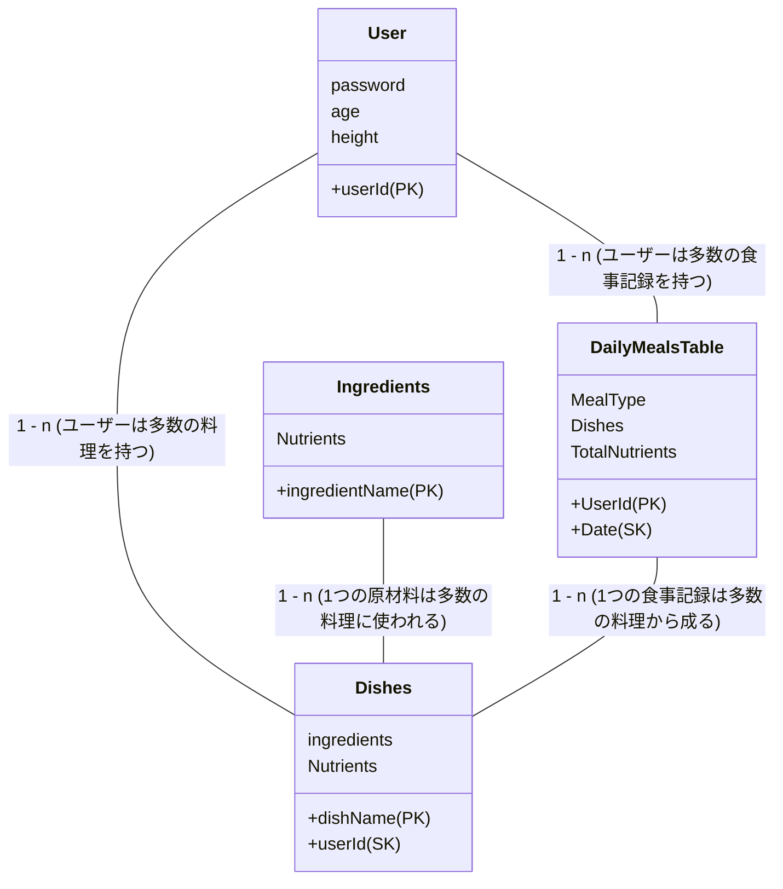

# ヴィーガン向け体調管理アプリ

## 設計

### テーブル図

#### Userテーブル

| カラム名  | 説明       |
|---------|-----------|
| userId  | ユーザーID (パーティションキー) |
| password | パスワード   |
| age     | 年齢       |
| height     | 身長 |

---

#### Dishesテーブル
ユーザーが入力orデフォルトである料理を保存. ユーザーが新たな料理を追加したりすることが可能. 

| カラム名       | 説明                                               |
|--------------|--------------------------------------------------|
| dishName       | 料理の名前 (パーティションキー)                               |
| userId       | ユーザーID (ソートキー)                                   |
| ingredients  | 原材料をリストで保存                                   |
| Nutrients    | 原材料から計算された栄養成分情報                             |

---

#### DailyMealsTable
各ユーザーがその日に何を食べたのか、そしてその日の合計栄養摂取量を保存

| カラム名     | 説明                               |
|------------|----------------------------------|
| UserId     | ユーザーのID (パーティションキー)          |
| Date   | 食事の日 (ソートキー)                  |
| MealType   | 朝食、昼食、夕食など                        |
| Dishes     | 選択された料理のリスト(料理IDや名前、量など) |
| TotalNutrients| その日の全ての栄養素の合計                      |

---

#### Ingredientsテーブル
原材料の栄養を保存. dishesの料理の栄養計算に利用される. 

| カラム名        | 説明                               |
|---------------|----------------------------------|
| ingredientName| 原材料の名前(パーティションキー)                 　|
| Nutrients     | 原材料の栄養成分情報                          |

---

